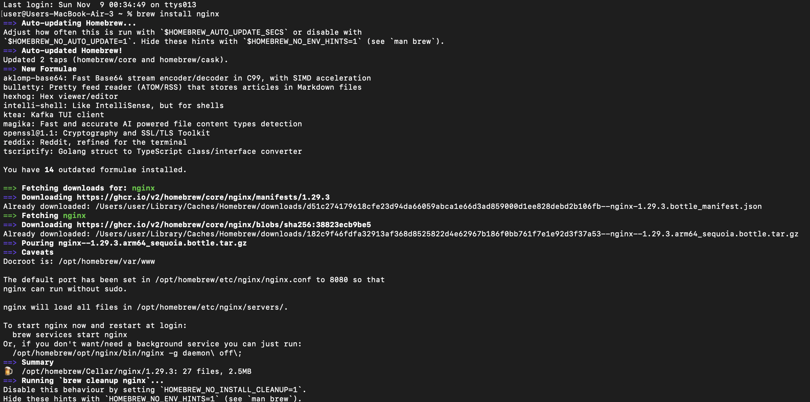
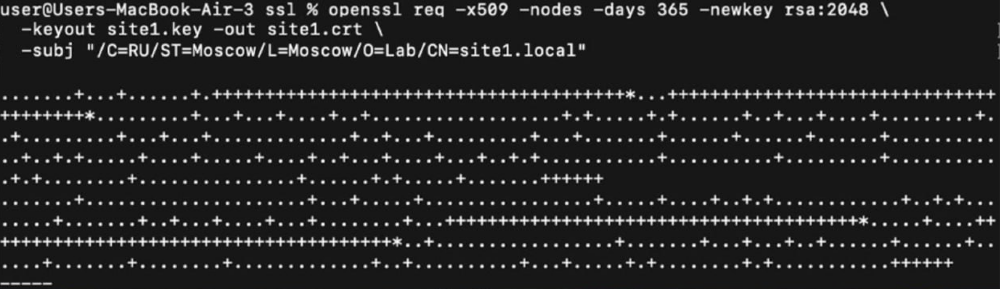
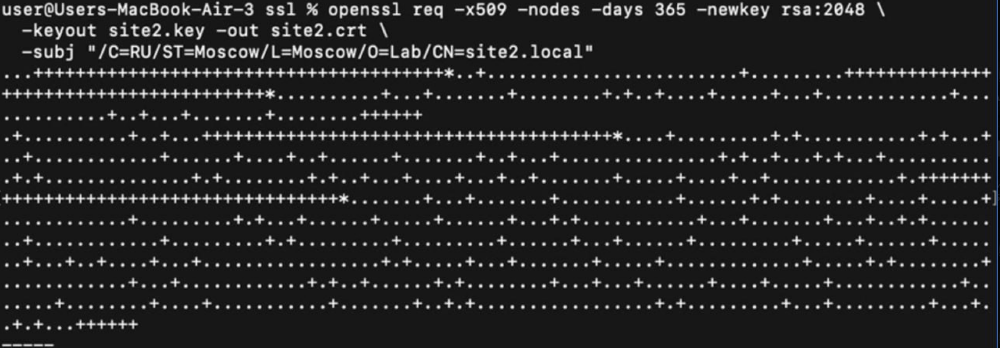
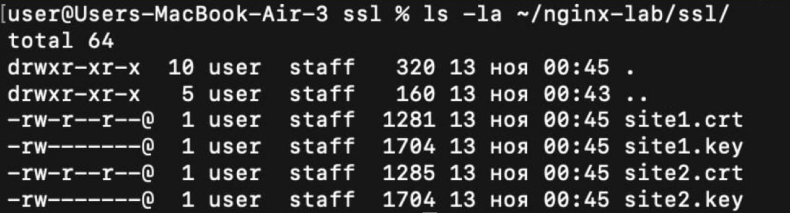

# Лабораторная работа №1 обычная 
## Устанавливаем nginx 
Используем команду 'brew install nginx'



## 1. Должен работать по https c сертификатом
Генерируем SSL сертификаты
Для site1: ```openssl req -x509 -nodes -days 365 -newkey rsa:2048 \
  -keyout site1.key -out site1.crt \
  -subj "/C=RU/ST=Moscow/L=Moscow/O=Lab/CN=site1.local"```

- ```-x509``` - Стандартный формат сертификата  
- ```-nodes``` - Означает что не нужно шифровать приватный ключ паролем  
- ```-days 365``` - Означает что сертификат валиден 365 дней  
- ```-newkey rsa:2048``` - Создает новую пару ключей, длиной 2048 бит  
- ```-keyout site1.key``` - путь к файлу куда будет сохранен приватный ключ  
- ```-out site1.crt``` - путь к файлу куда будет сохранен сертификат
- ```-subj "/C=RU/ST=Moscow/L=Moscow/O=Lab/CN=site1.local"``` - указание данных сертификата (страна, город)



Для site2: ```openssl req -x509 -nodes -days 365 -newkey rsa:2048 \
  -keyout site2.key -out site2.crt \
  -subj "/C=RU/ST=Moscow/L=Moscow/O=Lab/CN=site2.local"```



Проверяем что сертификаты созданы:
```ls -la ~/nginx-lab/ssl/```


