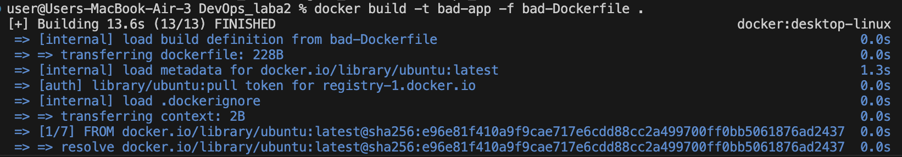
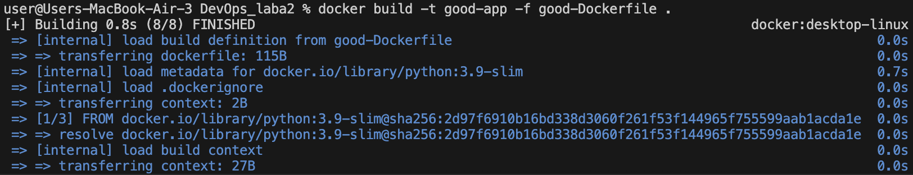
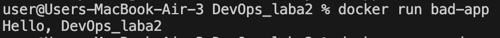
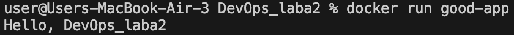

# Лабораторная работа №2 обычная
## bad-Dockerfile
```
FROM ubuntu:latest

RUN apt-get update
RUN apt-get install -y python3
RUN apt-get install -y python3-pip  

COPY . /app
WORKDIR /app
CMD ["python3", "app.py"]
```
## good-Dockerfile
```

FROM python:3.9-slim

WORKDIR /app
COPY app.py .
CMD ["python", "app.py"]

```
## app.py
```print("Hello, DevOps_laba2")```
## Плохие практики в докерфайле и как их испрвить 

1. Использование ```FROM ubuntu:latest``` - непредсказуемая версия. 
В хорошем докерфайле изменили на ```FROM python:3.9-slim``` - фиксированная версия , уже содержит Python , поэтому не нужно устанавливать вручную, что улучшае стабильность сборки 

2. Установка ненужных пакетов , неоптимизированные слои 
```
RUN apt-get update
RUN apt-get install -y python3
RUN apt-get install -y python3-pip  
```
Создание 4 отдельных образов в докерфайле 
- ```python3-pip``` - нужен для установки библиотек (для моего app.py не требуется)
- ```python3``` - скачивает пайтон , в хорошем докерфайле это сделанно с помощью ```FROM python:3.9-slim```
 

В хорошем докерфайле просто убираем всё это, что делает сборку быстрее и минимизирует количество слоёв 

3. Копирование всего проекта 
- ```COPY . /app``` - копирует весь проект 
- Изменяем на ```COPY app.py .``` - что копирует только нужный нам файл 

## Билдим и запускаем докерфайлы 
- ```docker build -t bad-app -f bad-Dockerfile . ``` - для плохого докерфайла 
- ```docker build -t good-app -f good-Dockerfile .``` - для хорошего докерфайла 




Видим что сборка хорошего докерфайла занимает намного меньше времени , если сравнивать с плохим


Запускаем:
```
docker run bad-app
docker run good-app 
```



## Плохие практики при работе с контейнерами
